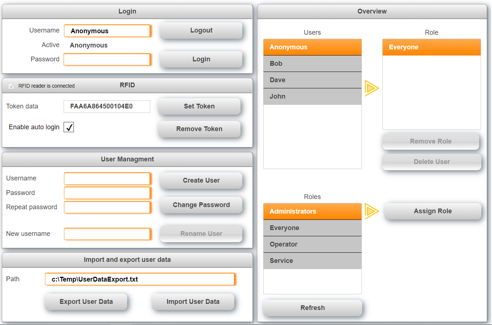

## Table of Contents
* [Introduction](#Introduction)
* [Requirements](#Requirements)
* [Description](#Description)
* [Limitations](#Limitations)
* [Revision History](#Revision-History)

## Introduction
This is an extension to the sample project for a user managment with mappView. It uses the B&R RFID reader to identify and login users automatically. For details about the standard example see the [**master**](https://github.com/stephan1827/mappView-User) branch.

Also see [**How to import the user management into an existing project.**](/Logical/mappUser/HowToImport.pdf) Download the latest release from [**here.**](https://github.com/stephan1827/mappView-User/archive/V0.4.zip)

## Requirements
* Automation Studio 4.5
* mappView 5.6
* Automation Runtime D4.52
* RFID Reader 5E9010.29

Recommended task class is #8 with a 10ms cycle time.

## Description
The task RFID controls the RFID reader connected via USB to the PLC. The reader will be automatically detected. When a token/key is presented to the reader, the token data is read and the user identified. The token data is also used as user password. This has the advantage that the user can login even if the reader is not available. The following functions are currently supported.

* Scan USB for RFID reader
* Assign token to user
* Remove token from user

The task and mappView visualization use an interface to communicate that can also be used to trigger functions external. 

The structure looks as follows:

RFID
* CMD -> Used to trigger commands like assign and remove token, ... A command is triggered by setting it to true, when the command is finished the task will reset the command. This indicates that the command is finished. Do not change any parameters or set another command until the previous command is finished.
  * AutoScan -> Start detecting and reading data from the RFID reader
  * TokenAssign -> Assign token to user
  * TokenAssign -> Remove token from user
* PAR -> Parameters like refresh intervall, auto login...
  * RefreshIntervall -> Polling intervall for requesting new data frrom the reader
  * DataLenMin -> Minimum length of the token data, this is used to reduce false readings
  * AutoLogin -> Automatically login user when token is identified
  * UserName -> The user name affected by a command
  * Password -> Password used for this
* DAT -> Token data as well as some status information
  * IsConnected -> Indicates that RFID reader is connected via USB
  * Data -> Token information
  * Cnt -> Number of token reads
  * Status -> Shows the last command result or error message
* VIS -> Data specific for the visualization
  * ExecuteLogin -> Trigger to login user
  * ShowMessageBoxOK -> Show a message box when command was successful
* ERR -> Information about errors
  * Number -> Error number
  * State -> State where the error occurred

# Assign new token to user
1.	Select the user to which the token should be assigned. If this is a new user create the user with an empty password first
2.	Present the token to the reader, a message box should indicate that this token is not assigned to any user yet

3.	Acknowledge the message box with OK
4.	Press the “Assign Token” button to connect the token and user

## Limitations
* The sample is not yet multi-client capable
* Only one RFID reader is supported at this time

## Revision History

Version 0.4
- Software structure change to work with future expansion
- Make sure passwords match before user is created
- Added support for RFID reader
