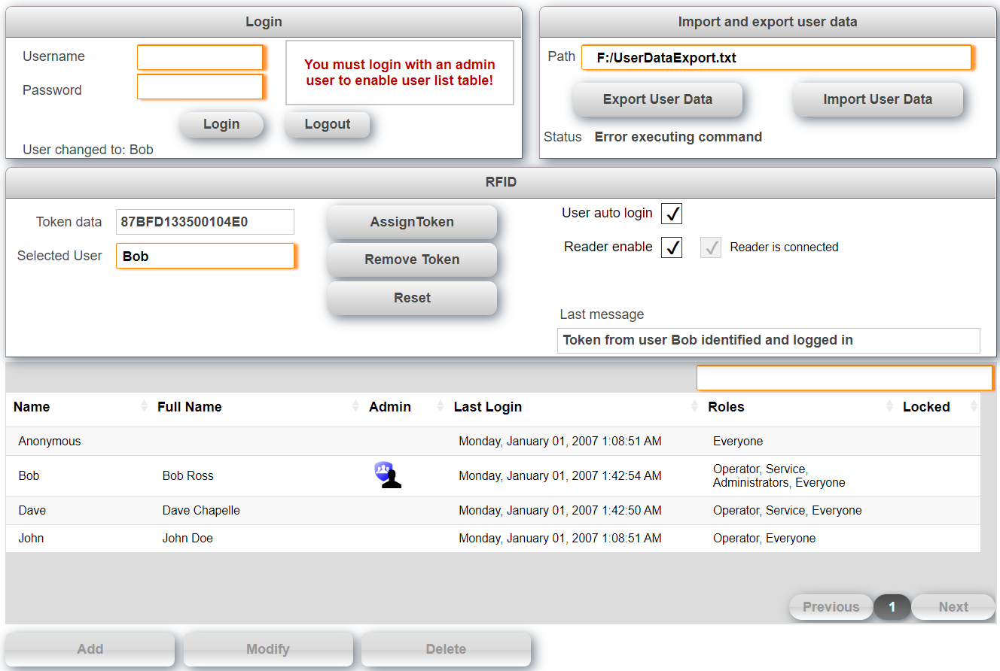

## Table of Contents
* [Introduction](#Introduction)
* [Requirements](#Requirements)
* [Description](#Description)
* [Error numbers](#Errors)
* [Limitations](#Limitations)
* [Revision History](#Revision-History)

## Introduction
This is a sample project for a user management with mappView. It uses the B&R library ArUser to access and modify user rights. There is an extended sample with RFID reader support available as separate [**branch**](https://github.com/stephan1827/mappView-User/tree/RFID).

The passwords for the users in this demo is the user name all lower case. Also see [**How to import the user management into an existing project.**](Logical/mappUser/HowToImport.pdf) Download the latest release from [**here.**](https://github.com/stephan1827/mappView-User/releases/latest)

## Requirements
* Automation Studio 4.5
* mappView 5.6
* Automation Runtime D4.52

Recommended task class is #8 with a 10ms cycle time.

## Description
The sample consists of two main components. The sample page is used to display all important settings for users and roles. The task UserManagement drives the user management and uses the ArUser library in the background. The following functions are currently supported.

* Create, rename and delete user
* Assign and remove roles from users
* Change password
* Import export user information

The sample supports up to 3 concurrent client connections. While the task itself can only execute one command at a time the commands are executed so fast that this should not be an issue. The refresh command may take longer but the response data is distributed to all seesions. The task and mappView visualization use an interface to communicate that can also be used to trigger functions external. The structure *ArUser* looks as follows:

<table>

  <tr>
    <td width=100>Level 1</td>
    <td>Level 2</td>
    <td>Level 3</td>
    <td>Level Description</td>
  </tr>
  <tr style="font-weight:bold">
    <th>CMD</th>
    <td colspan="4">Used to trigger commands like create user, change password, ... A command is triggered by setting it to true, when the command is finished the task will reset the command. This indicates that the command is finished. Do not change any parameters or set another command until the previous command is finished.</td>
  </tr>
  <tr>
   <td></td>
   <td>UserCreate</td>
   <td colspan="4">Create a new user</td>
  </tr>
  <tr>
   <td></td>
   <td>UserDelete</td>
   <td colspan="4">Delete an existing user</td>
  </tr>
   <tr>
   <td></td>
   <td>UserRename</td>
   <td colspan="4">Rename an existing user</td>
  </tr>
   <tr>
   <td></td>
   <td>RoleAssign</td>
   <td colspan="4">Assign role to user</td>
  </tr>
   <tr>
   <td></td>
   <td>RoleRemove</td>
   <td colspan="4">Release role from user</td>
  </tr>
   <tr>
   <td></td>
   <td>Import</td>
   <td colspan="4">Import all user data to file</td>
  </tr>
   <tr>
   <td></td>
   <td>Export</td>
   <td colspan="4">Export all user data into a file</td>
  </tr>
   <tr>
   <td></td>
   <td>ListRefresh</td>
   <td colspan="4">Refresh user list</td>
  </tr>
   <tr>
   <td></td>
   <td>ErrorReset</td>
   <td colspan="4">Reset error</td>
  </tr>
  <tr>
    <th> PAR </th>
    <td colspan="4">Parameters like user name, file path to export data, ...</td>
  </tr>
   <tr>
   <td></td>
   <td>FilePath</td>
   <td colspan="4">This is where import and export files are stored. Note that this is the absolute path and not a file device as it would be used for many other functions. Use "F:/" for the user partition.</td>
  </tr>
   <tr>
   <td></td>
   <td>UserName</td>
   <td colspan="4">The user name affected by a command</td>
  </tr>
   <tr>
   <td></td>
   <td>UserNameNew</td>
   <td colspan="4">The new user name used when renaming a user</td>
  </tr>
    <tr>
   <td></td>
   <td>UserRole</td>
   <td colspan="4">The user role used with the assign and remove command</td>
  </tr>
    <tr>
   <td></td>
   <td>Password</td>
   <td colspan="4">Password used for user create and password change</td>
  </tr>
    <tr>
   <td></td>
   <td>PasswordRepeat</td>
   <td colspan="4">Must match the password in previous variable 'Password'</td>
  </tr>
  <tr>
   <td></td>
   <td>VisuSlotID</td>
   <td colspan="4">This is the session ID for the current command. This is used to identify where to send response messages.</td>
  </tr>
  <tr>
    <th> DAT </th>
    <td colspan="4">User data and roles as well as some status information</td>
  </tr>  
  <tr>
   <td></td>
   <td>Users</td>
   <td colspan="4">A list with all users in the system</td>
  </tr>
  <tr>
   <td></td>
   <td></td>
   <td>Name</td>
   <td colspan="4">Name of user</td>
  </tr>
  <tr>
   <td></td>
   <td></td>
   <td>Roles</td>
   <td colspan="4">Roles assigned to this user</td>
  </tr>
  <tr>
   <td></td>
   <td>ErrorReset</td>
   <td colspan="4"></td>
  </tr>
  <tr>
   <td></td>
   <td>Roles</td>
   <td colspan="4">A list with all roles in the system</td>
  </tr>
     <tr>
   <td></td>
   <td>Status</td>
   <td colspan="4">Shows the result for the last command</td>
  </tr>
   <tr>
   <td></td>
   <td>UserActive</td>
   <td colspan="4">This is a list of users that are currently logged in</td>
  </tr>
  <tr>
    <th> VIS </th>
    <td colspan="4">Data specific for the visualization. The structure is an array, one for each client session</td>
  </tr>       
  <tr>
   <td></td>
   <td>ListUsers</td>
   <td colspan="4">Data provider of list box for all users</td>
  </tr>
  <tr>
   <td></td>
   <td>ListUsersIndex</td>
   <td colspan="4">Index of user list box for all users</td>
  </tr>
  <tr>
   <td></td>
   <td>ListUserValue</td>
   <td colspan="4">Selected user name</td>
  </tr>
  <tr>
   <td></td>
   <td>ListUserRole</td>
   <td colspan="4">Data provider of list box for selected user roles</td>
  </tr>
  <tr>
   <td></td>
   <td>ListUserRoleIndex</td>
   <td colspan="4">Index of user list box for selected user roles</td>
  </tr>
  <tr>
   <td></td>
   <td>ListRoles</td>
   <td colspan="4">Data provider of list box for all roles</td>
  </tr>
  <tr>
   <td></td>
   <td></td>
   <td colspan="4"></td>
  </tr>
  <tr>
   <td></td>
   <td>ListRolesIndex</td>
   <td colspan="4">Index of role list box for all roles</td>
  </tr>
  <tr>
   <td></td>
   <td>RoleDeleteEnabled</td>
   <td colspan="4">Enables/Disables the button to delete a role</td>
  </tr>
  <tr>
   <td></td>
   <td>UserDeleteEnabled</td>
   <td colspan="4">Enables/Disables the button to delete or rename a user</td>
  </tr>
  <tr>
   <td></td>
   <td>ShowMessageBoxOK</td>
   <td colspan="4">Show a message box when command was successful</td>
  </tr>
  <tr>
   <td></td>
   <td>ShowMessageBoxError</td>
   <td colspan="4">Show a message box when command was not successful</td>
  </tr>
   <tr>
    <th> ERR </th>
    <td colspan="4">Information about errors</td>
  </tr>
   <tr>
   <td></td>
   <td>No</td>
   <td colspan="4">Error number</td>
  </tr>
  <tr>
   <td></td>
   <td>State</td>
   <td colspan="4">State where the error occurred</td>
  </tr>
  <tr>
   <td></td>
   <td>Text</td>
   <td colspan="4">Error text</td>
  </tr>

</table>

## Error
The sample generates the following list of error messages. All other error numbers are generated from included libraries that can be found in the Automation Studio help.

| No | Constant | Text |
|---|---|---|
| 50000 | ERR_PASSWORD_MISMATCH  | The two passwords "Password" and "PasswordRepeat" don't match  |
| 50001 | ERR_USER_LIST_TOO_SHORT  | More users found than fit into user list  |
| 50002 | ERR_ROLE_LIST_TOO_SHORT  | More roles found than fit into the role list  |
| 50003 | ERR_DELETE_CURRENT_USER  | Logged in user can not be deleted  |
| 50004 | ERR_RENAME_CURRENT_USER  | Logged in user can not be renamed  |
| 50005 | ERR_USER_ROLE_NAME_SIZE  | Logged in user can not be renamed*  |
| 50010 | ERR_TOO_MANY_CLIENTS  | More than 3 clients try to connect to user management  |
 

## Limitations
* Roles cannot be created or deleted. This is because the permission for roles cannot be changed on the fly.

## Revision History

#### Version 0.5
- Multi client support
- Changed error structure

#### Version 0.4
- Software structure change to work with future expansion
- Make sure passwords match before user is created

#### Version 0.3
- Automatically set password when new user is created
- Erase password field when user logs out
- New command to rename user

#### Version 0.2
- Make sure last user cannot be deleted
- Make sure last user cannot delete himself
- Make sure last user cannot be deleted
- Added group box with login
- Added message boxes for success and failed commands
- Visual tweaks and bug fixes

#### Version 0.1
First public release
